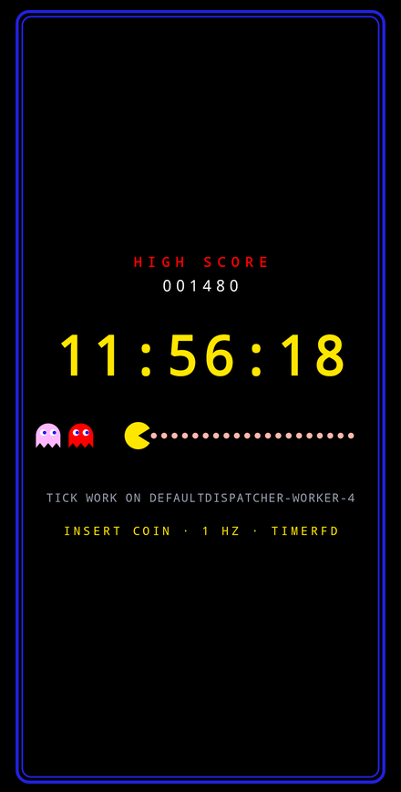
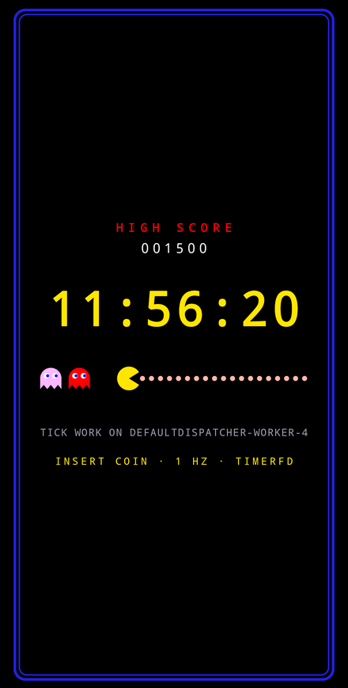

<div align="center">



<br>


</div>

```kotlin
ticker(Dispatchers.IO) { readStats() }                          // 1 Hz, on IO
ticker(Dispatchers.Default, period = 250.milliseconds) { it }   // 4 Hz
```

One function. It asks the Linux kernel to fire **exactly on the wall-clock
boundary** and wires that signal into the main thread's existing event loop.
No threads, no drift, no wakelocks.

---

## 🕹️ THE PROBLEM — why this repo exists

It started with a clock app. The status bar clock flips to `12:00:01`… and my
clock flips a beat later. Or early. Or — worst of all — *sometimes* in sync,
so the jitter is what your eye catches.

Every timer Android hands you schedules a **relative delay** and hopes it
lands near the time you wanted:

- `delay(1000)` in a loop measures from *when the coroutine resumed*, so every
  lap adds queue latency to the last — classic accumulating drift.
- `Handler.postDelayed` runs on `uptimeMillis`, which isn't even the wall
  clock — pausing during deep sleep and never noticing the user changed the time.
- `CountDownTimer` and `Timer` inherit both problems, and `Timer` spawns a
  whole thread just to be late.

<div align="center">

</div>

You can fight it — re-align after every tick, listen for `ACTION_TIME_CHANGED`
broadcasts, do modular arithmetic on `System.currentTimeMillis()` — and every
clock app ends up with that same pile of corrective code. The kernel, however,
has had the right primitive since Linux 2.6.25: a timer you arm **absolutely**
("fire at 12:00:02.000000000 REALTIME"), that tells you when the user changes
the clock. Android just never exposed it as an API.

This repo is that missing API.

## 👻 THE GHOSTS

| Ghost | Known as | Haunting behavior |
|---|---|---|
| 🔴 Blinky | `CountDownTimer` | drifts, and dies with its Handler |
| 🩷 Pinky | `Handler.postDelayed` | queue-dependent, always a few ms behind you |
| 🩵 Inky | `Timer` / `TimerTask` | spawns a thread just to be late |
| 🟠 Clyde | coroutine `delay` loop | wanders, accumulates drift, needs re-alignment |

**ticker** is the power pellet. The ghosts turn blue and the boundary is yours.

## ⚙️ HOW THE MACHINE WORKS

A `timerfd` — a Linux kernel timer exposed as a file descriptor — is armed
**absolutely** on `CLOCK_REALTIME` boundaries and registered into the main
thread's `Looper` via `ALooper_addFd`. The main thread's own `epoll_wait` —
the same one already servicing input and vsync — wakes when the kernel fires.

- **No thread is created.** The tick arrives on the main thread's existing wait.
- **No `Message` is allocated.** Per-tick cost is an 8-byte `read()` and a channel send.
- **No drift is possible.** Expiries are absolute timestamps, not stacked delays.

This is the same primitive Chromium uses internally for its Android message
pump — exposed here as a one-line ticker API. Same maze, secret warp tunnel.

## 🏆 HIGH SCORE TABLE

| | 👻 `postDelayed` / `delay` loop | 🟡 ticker |
|---|---|---|
| Boundary accuracy | 1–10ms late, queue-dependent | **36–924µs** (measured, Pixel 6 Pro) |
| Clock domain | `uptimeMillis`, faked to wall time | `CLOCK_REALTIME`, native |
| User sets the clock | wrong until you wire up broadcasts | kernel reports it (`TFD_TIMER_CANCEL_ON_SET`); corrective tick fires immediately |
| Accumulated drift | yes, needs re-alignment logic | none — absolute expiries |
| Threads created | 0–1 depending on flavor | **0** |
| Idle cost when nobody collects | n/a | **zero** — the fd doesn't exist |

## 🪙 INSERT COIN — usage

```kotlin
// In a ViewModel — per-tick work runs on IO, timer stays on the main looper:
val ticks: StateFlow<Stats?> =
    ticker(Dispatchers.IO) { epochSeconds -> sample(epochSeconds) }
        .stateIn(viewModelScope, SharingStarted.WhileSubscribed(5_000), null)
```

The flow is:

- **cold** — each collector gets its own kernel timer (one player, one
  machine); cancellation releases it.
- **conflated** — a slow collector skips to the newest boundary instead of
  replaying missed dots.
- **fail-fast** — if the kernel timer can't be created it throws; it never
  silently degrades to a weaker mechanism. No continues on a broken cabinet.

`period` is any positive `Duration` (default 1 second). Ticks fire on exact
wall-clock multiples of the period — a 250ms ticker lands on
:000/:250/:500/:750 — and each tick carries the exact boundary timestamp in
epoch millis, so consecutive ticks always differ by exactly the period.
Shorter periods mean proportionally more wake-ups; regardless of period, the
ticker never holds a wakelock and cannot wake a suspended device (plain
`CLOCK_REALTIME`, not `_ALARM` — the machine sleeps when the arcade closes).

The `transform` lambda is part of the API on purpose: it's the only way to
guarantee your per-tick work runs on the dispatcher you named. A `.map` added
after the flow would run in the collector's context — the classic Flow
threading footgun, made unrepresentable. That ghost can't enter this maze.

Need the raw callback instead of a Flow? `TickerFd(onTick)` with
`start()`/`stop()` (main thread only) is the escape hatch.

## ✨ POWER PELLETS — properties

- **Zero threads** — verified: ticks arrive on the thread that registered
  (tid == pid in the demo), and the library never spawns anything.
- **Zero leaks** — instrumented test runs 100 start/stop cycles and asserts
  the process fd table is unchanged. Every dot eaten, none left behind.
- **~7KB per ABI** — no C++ stdlib (`ANDROID_STL=none`), no exceptions/RTTI,
  hidden symbol visibility, `-Oz`. The only dependency is kotlinx-coroutines.
- **R8-safe** — consumer keep rules ship inside the AAR; the JNI name lookups
  survive minified release builds.
- **Lifecycle-correct by construction** — collection stopping (screen off,
  `WhileSubscribed` timeout) closes the fd; there is nothing to forget.
  GAME OVER actually means game over.

## 🗺️ THE MAZE — modules

- `:ticker` — the library (Kotlin API + ~150 lines of C).
- `:app` — demo: a clock whose digits flip on the true second, with the
  tick-transform's thread shown live under it.

## 📺 ATTRACT MODE — the demo app

The demo is the cabinet itself. One lap of the corridor = one minute:
Pac-Man's position, his chomp, the eaten dots, the score (10 pts per tick),
and even the INSERT COIN blink are **pure functions of the tick** — there is
no continuous animation anywhere. If Pac-Man chomps, a `timerfd` fired on the
boundary. A frozen Pac-Man means no ticks. Two consecutive seconds on a
Pixel 6 Pro:

<div align="center">
<table>
<tr>
<td></td>
<td></td>
</tr>
<tr>
<td align="center"><sub>tick <i>n</i> — chomp open</sub></td>
<td align="center"><sub>two ticks later — dots eaten, +20 pts</sub></td>
</tr>
</table>
</div>

## 🎮 CABINET REQUIREMENTS

minSdk 24, NDK/CMake toolchain for building from source. No Compose, no
lifecycle, no transitive baggage — bring your own UI layer.

<div align="center">



</div>
